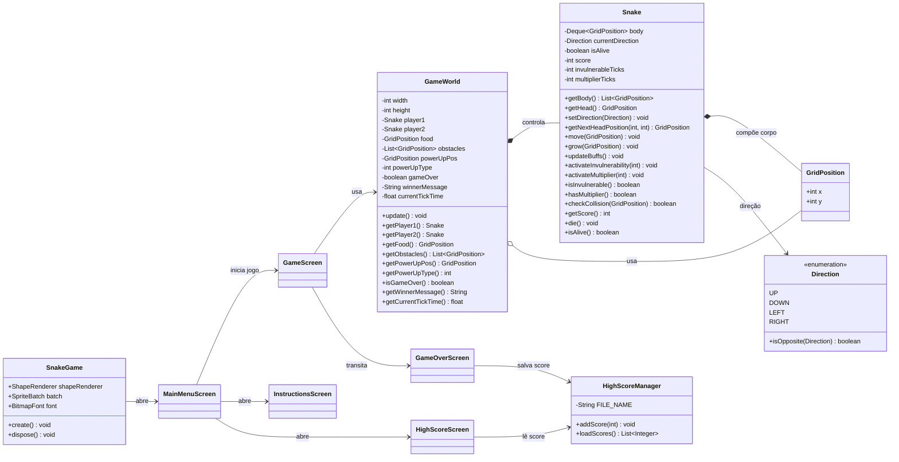

# 🐍 Jogo da Cobrinha Pixelado (Snake Game)

Um clone moderno e expandido do clássico jogo da cobrinha (Snake), construído do zero com foco em arquitetura Orientada a Objetos, separação de responsabilidades (Backend/Frontend) e persistência de dados local.

Desenvolvido em **Java 21** e **LibGDX** como projeto prático para a disciplina de Programação Orientada a Objetos (SCC504) do Instituto de Ciências Matemáticas e de Computação (ICMC-USP).

## Tecnologias Utilizadas
* **Linguagem:** Java 21
* **Framework Gráfico:** LibGDX (Desktop/LWJGL3)
* **Build System:** Gradle
* **Arquitetura:** Design Patterns aplicados à Game Loop, separação estrita de regras de negócio (GameWorld/Snake) e apresentação (Screens).

## Funcionalidades e Mecânicas

### Core Gameplay
* **Multiplayer Local:** Player 1 (Setas Direcionais) e Player 2 (WASD).
* **Wrap-around:** O cenário não tem bordas sólidas, as cobras realizam *teletransporte* de uma extremidade à outra da matriz.
* **Sistema de Colisões Letal:** Morte ao colidir contra a outra cobra, o próprio corpo ou os obstáculos do mapa.

### Sistemas Dinâmicos
* **Geração de Obstáculos:** Rochas surgem no cenário dinamicamente ao longo do tempo (baseado em ticks), limitando o espaço e aumentando a dificuldade.
* **Resolução Dinâmica:** O jogador pode escolher o tamanho da grade (Pequeno, Normal, Épico) e a velocidade inicial diretamente pelo Menu Principal.

### Itens Especiais (Power-ups)
* 🍎 **Comida Normal:** Cresce a cobra e aumenta ligeiramente a velocidade geral do jogo.
* ⭐ **Estrela (Multiplicador):** Multiplica a pontuação ganha por 3 temporariamente.
* 🛡️ **Escudo (Invulnerabilidade):** Concede o efeito fantasma (alpha visual e invulnerabilidade), permitindo atravessar a outra cobra, obstáculos e o próprio corpo por um curto período.

### UI & Persistência de Dados
* **I/O de Arquivos:** Sistema de High Scores isolado (`HighScoreManager`) que lê e grava os 5 melhores pontuadores em um arquivo `.txt` local.
* **Interface Personalizada:** Fontes em Bitmap modificadas nativamente via código para ajustes de *spacing* e contornos estilizados (Tinting/Overlay).
* **Áudio:** Efeitos sonoros para coleta de itens, power-ups e mortes gerenciados por *flags* no ciclo de renderização.

## Autores
* **André Luís**, **Renan Soriano** & **André Luiz** *Estudantes de Sistemas de Informação - ICMC/USP.*

## Como rodar corretamente

### Requisitos

- **JDK 21**
- **Gradle Wrapper** incluído no projeto
- Ambiente desktop com suporte a **LWJGL3/OpenGL**

### Estrutura

O projeto principal está em `GDX/`.

### Baixar e executar

```bash
cd GDX
./gradlew lwjgl3:run
```

No Windows:

```bat
cd GDX
.\gradlew.bat lwjgl3:run
```

### Build do projeto

```bash
cd GDX
./gradlew build
```

### Gerar JAR executável

```bash
cd GDX
./gradlew lwjgl3:jar
```

O artefato sai em `GDX/lwjgl3/build/libs/`.

### Configuração do ambiente

- Use o **JDK 21** no projeto/IDE.
- Abra o diretório `GDX/` como projeto Gradle.
- Garanta que a pasta `assets/` esteja disponível no diretório raiz do projeto `GDX`.
- O arquivo `highscores.txt` é salvo localmente e precisa ter permissão de escrita.

## UML das classes principais

### UML em texto

```text
SnakeGame
  - shapeRenderer: ShapeRenderer
  - batch: SpriteBatch
  - font: BitmapFont
  + create(): void
  + dispose(): void

GameWorld
  - width: int
  - height: int
  - player1: Snake
  - player2: Snake
  - food: GridPosition
  - obstacles: List<GridPosition>
  - powerUpPos: GridPosition
  - powerUpType: int
  - gameOver: boolean
  - winnerMessage: String
  - currentTickTime: float
  + update(): void
  + getPlayer1(): Snake
  + getPlayer2(): Snake
  + getFood(): GridPosition
  + getObstacles(): List<GridPosition>
  + getPowerUpPos(): GridPosition
  + getPowerUpType(): int
  + isGameOver(): boolean
  + getWinnerMessage(): String
  + getCurrentTickTime(): float

Snake
  - body: Deque<GridPosition>
  - currentDirection: Direction
  - isAlive: boolean
  - score: int
  - invulnerableTicks: int
  - multiplierTicks: int
  + getBody(): List<GridPosition>
  + getHead(): GridPosition
  + setDirection(Direction): void
  + getNextHeadPosition(int, int): GridPosition
  + move(GridPosition): void
  + grow(GridPosition): void
  + updateBuffs(): void
  + activateInvulnerability(int): void
  + activateMultiplier(int): void
  + isInvulnerable(): boolean
  + hasMultiplier(): boolean
  + checkCollision(GridPosition): boolean
  + getScore(): int
  + die(): void
  + isAlive(): boolean

GridPosition
  + x: int
  + y: int

Direction <<enum>>
  + UP
  + DOWN
  + LEFT
  + RIGHT
  + isOpposite(Direction): boolean

HighScoreManager
  - FILE_NAME: String
  + addScore(int): void
  + loadScores(): List<Integer>
```

### UML em diagrama



## Conceitos de POO aplicados

- **Encapsulamento**: atributos de estado ficam privados em `Snake` e `GameWorld`, expondo apenas métodos controlados.
- **Abstração**: as telas escondem detalhes de renderização e entrada; o jogo usa `GameWorld` sem saber como a lógica é desenhada.
- **Composição**: `GameWorld` é formado por `Snake`, `GridPosition` e listas de obstáculos.
- **Reuso e separação de responsabilidades**: cada classe cuida de uma parte do problema, facilitando manutenção e testes.
- **Estado e comportamento**: `Snake` combina atributos (`score`, `body`, buffs) com métodos que manipulam esse estado.
- **Enumeração**: `Direction` modela um conjunto fechado de direções válidas.
- **Imutabilidade**: `GridPosition` é um `record`, o que reduz efeitos colaterais nas coordenadas.

## Plano de testes com JUnit

### 1. `SnakeTest`

- validar criação da cobra com corpo inicial correto;
- validar bloqueio de direção oposta;
- validar crescimento e pontuação;
- validar atualização de buffs e expiração dos efeitos;
- validar colisão com posições do corpo.

### 2. `GameWorldTest`

- validar inicialização com comida válida;
- validar movimento das duas cobras;
- validar colisão entre cobras;
- validar colisão com obstáculos;
- validar spawn de comida, obstáculos e power-ups em posições válidas;
- validar término de jogo e mensagem do vencedor.

### 3. `HighScoreManagerTest`

- validar leitura de arquivo vazio;
- validar adição e ordenação decrescente;
- validar corte para top 5;
- validar persistência e recarga dos scores.

### 4. `DirectionTest`

- validar `isOpposite()` para todos os pares relevantes.

### 5. `GridPositionTest`

- validar igualdade e uso como valor de coordenada.

### Observação para testes

Os testes de persistência devem usar arquivo temporário/local isolado para não sobrescrever o `highscores.txt` real.
